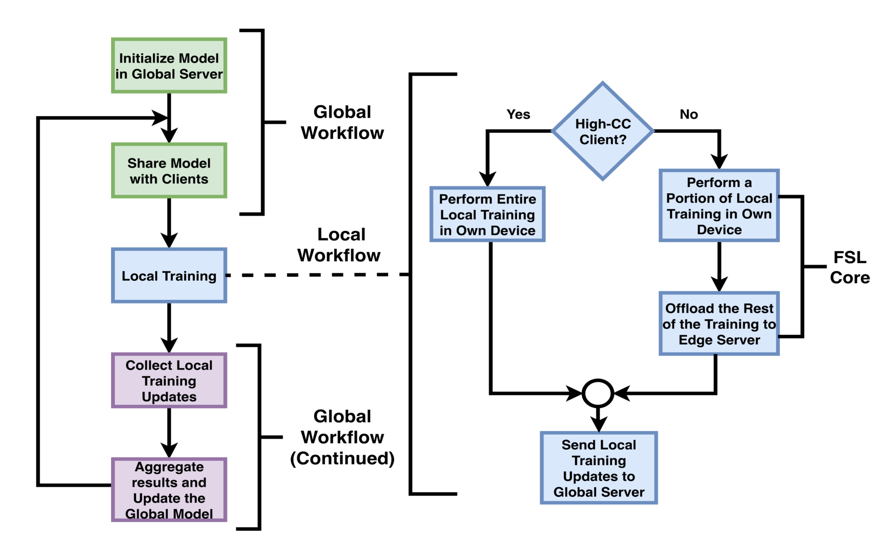

Read the publication at: https://ieeexplore.ieee.org/document/11498179

#Federated Split Learning (FSL):
A hybrid distributed learning framework of Federated Learning (FL) and Split Learning (SL). Addresses the local training issue of clients with low computational capacity in FL. 

##A brief on Federated Learning (FL): 
https://github.com/khrahaman/Federated_Learning.git

##Research Problem:
Participation of both low-end and high-end clients (clients with low and high computational capacity) can create unsynchronization in FL. How can we address this issue with resource utilization, minimum performance trade-offs and without requiring to update each low-end client's local hardware?

##Solution Methodology:
SL is a distributed learning paradigm where multiple parties collaborate together to train a single neural network. For example, a neural network's layers are distributed among a client (low-end) and a edge server (usually have more computational capacity than edge devices (clients)). The client trains the initial layers of the neural network (computationally-light) on local dataset, sends the result to the edge server, and the edge server continues to process the rest of the layers (computationally-heavy). 
In FSL, we identify the low-end clients in the network by a adaptive threshold mechanism, allow the low-end clients to train the local model in SL-manner. As a result we achieve more than 50% drop in local hardware-stress and execution time. 

